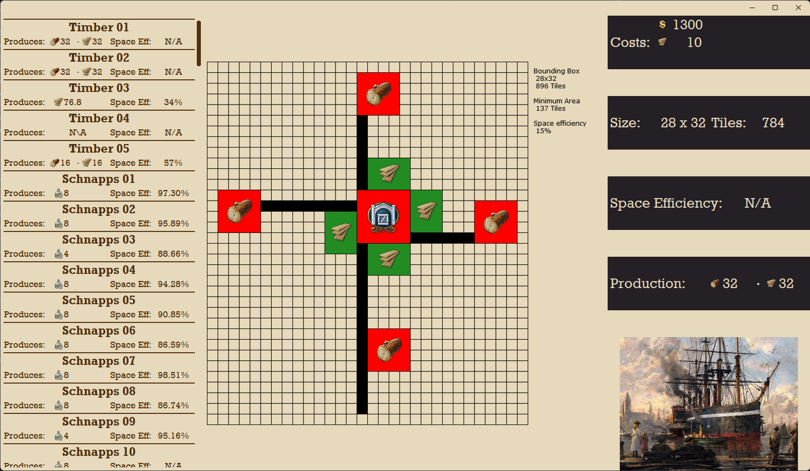
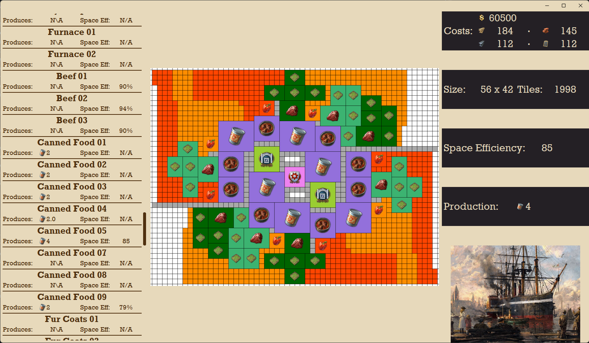

# Anno 1800 Layout Explorer

A desktop tool that scrapes building layout data from the Anno 1800 Wiki and presents it in an interactive user interface.  
The application allows players to quickly browse production layouts, inspect details, and explore efficiency information without navigating multiple wiki pages.

This project demonstrates skills in web scraping, UI development, and interactive data handling in Python.
---

## Features

- **Web Scraping:** Collects up-to-date production layout data directly from the Anno 1800 Wiki.
- **Structured Data Processing:** Parses and organizes raw HTML into usable Python data structures.
- **Interactive UI:** Displays all layouts in a scrollable sidebar for quick navigation.
- **Detail View:** Selecting a layout opens a detailed panel showing:
  - Production per minute  
  - Space requirements  
  - Workforce needs  
  - Category and building components  
- **Clean User Experience:** Designed to be simple, responsive, and easy to browse.

---

## Screenshots

### Simple Layout

### Complex Layout

---

## Technologies Used

- **Python 3.10+**
- **CustomTkinter** – modern themed user interface
- **Pillow** – image handling for layout icons (if applicable)
- **BeautifulSoup / Requests** – HTML scraping and parsing layer
- **Pandas** – structured data handling and CSV export

---

## Future Enhancements

- **Reintroduce sorting options with improved UI stability**
- **Add layout search or filtering by category**
- **Add optional dimension-based filtering in a new, more robust UI framework**
- **Introduce favoriting or bookmarking**

---

## Contact Info
Andrew Miller

Email: ajmiller611@live.com

GitHub: https://github.com/ajmiller611

